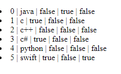

# Angular Topic Explanation

## 1. Property Binding
  - ### {{ }}  only bind the string not for other datatype like boolean
  #### example:
```  
 <input diasabled="{{true}}">
```
        
it won't work.
  - ### [ ] can be used for any type of datatype.
  #### example:
        <input [disabled]="true"> it work correctly.
  - ### you can use **bind-** keyword also
 #### example:
        <input bind-disable="true"> 

## 2. Class Binding
- ### [class]="name of the class" ,class name should be defined in the typescript file.
        <h1 [class]="danger">Hello world</h1>
     here **danger** is the class name defined inside the typescript.
  ### applying condition to the class:
        <h1 [class.sucess]="hasError">Hello world</h1>
     here **sucess** is the class name inside style tag not class name but **hasError** is the class name.
## 3.Style Binding
   #### syntax
      <h1 [style.color]="'red'"></h1>
   here while mentioning property use **' '** inside **" "**.
 - ####  we can use condition inside the style by using class binding.
 
 #### syntax
      <h2 [style.color]="isDanger?'orange':'red'">Hello world</h2>
here **isDanger** is the classname and we can use **ternary** operator.

 - #### Using classObject as a style to the tag.
      first define the **classObject**

            public styleObj={
            color:"blue",
            fontSize:"40px"
            }

      second use this **classObject** into the tag.

            <h2 [ngStyle]="styleObj">Hello world</h2>
      Now both **color** and **fontSize** is applicable for the **h2** element.
      <br>
      >Note:use **[ngStyle]** for the binding of class.
 ### 4.Event Binding
>Note:event can be represented by ( ) bracket.
```
<button (click)="display()" >Submit</button>
```
you can see **click** is within the ( ).here click is a event.

- we can also use **$event** for the event listener.
```
<button (click)="display($event)" >Submit</button>

//function
display(event){
      console.log(event)//it display all the event happened into that element.like type:click.
}
```
- you can also assign value to the variable there itself.
```
<button (click)="greeting="welcome lathesh" " >Submit</button>
{{greeting}}//display welcome lathesh
```
>here declaring greeting is important in the **ts** file.

### 5.Template refernce Variable
- we can define template reference variable by using **#** symbol.
- It is used to refer the html element .
```
<input #myVar type="text">
<button (click)="display(myVar.value)">Submit</button>

//function
display(value){
      console.log(value);//it display input value entered inside input tag.
}

```

### 6.Two Way Binding
- it is basically doing both **event** and **class** binding together.
- first event binding using ==( )== symbol here the value send from html element to the component class .
- second the stored value is again displayed using class binding ==[ ]==.
- here ==ngModel== is used to bind values.
- to use ==ngModel== we have to import ==FormModule== module inside **app.module**.
```
<input type="text" [(ngModule)]="name">
{{name}}

//class component
name="";
```
>Note: here class name should be same in both html and class component.

### 7.ngIf directive
- we can use this to remove or add the element.
```
<h1 *ngIf="display">Hello</h1>


//class component
public display=false;
```
- use can also use ==else== here,to use ==else== you should make use of **else** keyword. 
>Note:The block in else is should be inside the ng-template tag.
```
<h1 *ngIf="display; else elseBlock">Hello there</h1>
<ng-template #elseBlock>
    <h1>Else block</h1>
</ng-template>

```
**#** is template reference;it refer the template block with name *#elseBlock*.if you do with only h1 tag which is not inside the ng-template then you can met an error.

- other way to do this,
```
<div *ngIf="display; then thenBlock; else elseBlock"></div>
<ng-template #thenBlock>
    <h1 >Then Block</h1>
</ng-template>
<ng-template #elseBlock>
    <h1>Then Block</h1>
</ng-template>

```

### 8.ngSwitch directive
- use **[ngSwitch]="choice variable"**.
- then use ***ngSwitchCase="choice"**.
- if nothing is compare then default case will be executed by using **ngSwitchefault**
```
<div [ngSwitch]="color">
    <p *ngSwitchCase="'red'">Red</p>
    <p *ngSwitchCase="'green'">Green</p>
    <p *ngSwitchCase="'blue'">Blue</p>
    <p *ngSwitchDefault>choice color man</p>
</div>
```

### 9.ngFor directive
- it is used for an **array** element.
- it act like a for loop as in other languege.
#### syntax
```
<element *ngFor="let variableName of arrayName;index as secondVariable;odd as thirdVariableName;even as forthVariableName;last as fifthVariable;first as sixthVariable">
```
>Note: here index as,odd,even,first,last all are optional.we can find the index of the element by index of ,we can find the first an last,even an odd position element.it will return true or false.

```
<div *ngFor="let lang of arrayLang;index as i;odd as o;first as f;last as l;">
    <li>{{i}} | {{lang}} |  {{o}} | {{f}} | {{l}}</li>
</div>
```



### 10. Component Interaction
- It is used dto send the ata from child to parent and vise versa.
- to send data from the parent to child we have to use **classBinding**.
- we can send the value from  parent to the child with child tag.
#### syntax
```
<app-child [parentData]="outputVariable" ></app-child>


//class component
outputVariable="lathesh";
```
Now **lathesh** sen to the child component with the name as parentata.
- #### Recieving value from parent.
1.import input form core module.
2.use @input decorator.
```
@Input() public parentData:any;
```
>Note:the name passed by the parent an the recieve by child should be same.
Here **parentData** is same as parent send data.

3.use this variable to display or some operation on that data.
```
<p>chid {{parentData}}</p>//it display chid lathesh
```
- #### sending data from child to parent.
1.import output and eventEmitter from core module.
2.use @output and create new object of EventEmmiter.
```
@Output() public childEvent = new EventEmitter();
```
3.Now send the data from child to parent by calling function when click event triggered.
```
<button (click)="send()">Submit</button>


//class component
send(){
  this.childEvent.emit("Time is the soul");
}
```
>here **emit** method of the eventEmmiter is used for sending value from child to parent.
4.receive the value send from the child in parent.
```
<app-child (childEvent)="message=$event" [parentData]="outputVariable" ></app-child>
```
> - here **(childEvent)**  is the object of eventEmitter which is created inside the child.
>- **message** is the variable should be created inside the parent.
>- $event is the keyword used to get the data.
5.display the value now.
```
<h1>{{message}}</h1>
```
